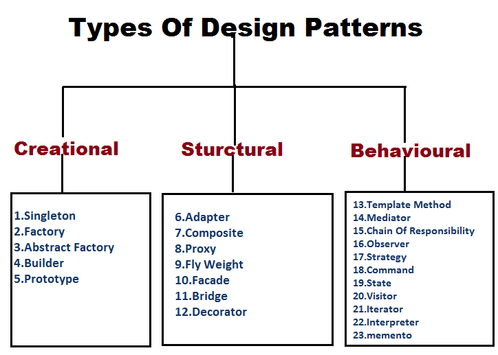

## What are design patterns actually ?

Design patterns are reusable solutions to common problems that occur during software design. They provide a template or blueprint for solving specific issues in a way that is proven, efficient, and maintainable. Design patterns are not finished code—they are general concepts that can be adapted to fit the needs of your application.
 

### Why Use Design Patterns?

Reusability: Solve problems using proven approaches. 
Maintainability: Make code easier to understand and modify. 
Scalability: Help design systems that can grow and adapt. 
Communication: Provide a shared vocabulary for developers.
 
 

